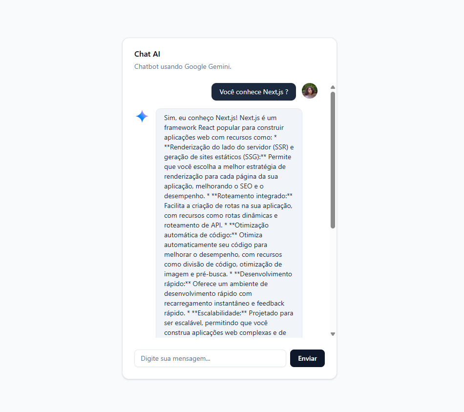

# 🤖 Chatbot com IA (Next.js)



## 📖 Sobre o Projeto

Este é um projeto de **Chatbot de Inteligência Artificial** desenvolvido com [Next.js](https://nextjs.org) (App Router). A aplicação oferece uma interface conversacional moderna e fluida, permitindo que usuários interajam com modelos de linguagem (LLMs) em tempo real.

O objetivo deste projeto foi explorar o desenvolvimento web moderno, manipulação de dados em tempo real (streaming) e integração de APIs de IA utilizando as melhores práticas do ecossistema React.

### ✨ Funcionalidades Principais

* **Interface Moderna:** UI limpa e responsiva construída com Tailwind CSS.
* **Respostas em Tempo Real:** Streaming de texto para uma experiência de chat dinâmica.
* **Histórico de Conversa:** Mantém o contexto das mensagens (se implementado).
* **Design Responsivo:** Funciona perfeitamente em desktop e dispositivos móveis.
* **Modo Escuro/Claro:** Suporte a temas (opcional).

## 🛠️ Tecnologias Utilizadas

* **Framework:** [Next.js 14+](https://nextjs.org/) (App Router)
* **Linguagem:** TypeScript
* **Estilização:** Tailwind CSS
* **Ícones:** Lucide React / React Icons
* **Integração IA:** Gemini
* **Deploy:** Vercel

## 🚀 Como Rodar o Projeto

Siga os passos abaixo para rodar a aplicação no seu ambiente local.

### Pré-requisitos

Certifique-se de ter instalado:
* [Node.js](https://nodejs.org/) (versão 18 ou superior)
* Gerenciador de pacotes (npm, yarn, pnpm ou bun)

### Instalação Passo a Passo

1.  **Clone o repositório:**
    ```bash
    git clone [https://github.com/oj0rel/ChatBot.git](https://github.com/oj0rel/ChatBot.git)
    cd ChatBot
    ```

2.  **Instale as dependências:**
    ```bash
    npm install
    # ou
    yarn install
    ```

3.  **Configure as Variáveis de Ambiente:**
    Crie um arquivo `.env.local` na raiz do projeto e adicione suas chaves de API. Use o exemplo abaixo:

    ```env
    # Exemplo (ajuste conforme a API que você utilizou)
    OPENAI_API_KEY=sua-chave-api-aqui
    
    # Se usou outra API, coloque a variável correspondente
    # NEXT_PUBLIC_API_URL=http://...
    ```

4.  **Execute o servidor de desenvolvimento:**
    ```bash
    npm run dev
    ```

5.  **Acesse a aplicação:**
    Abra [http://localhost:3000](http://localhost:3000) no seu navegador para ver o resultado.